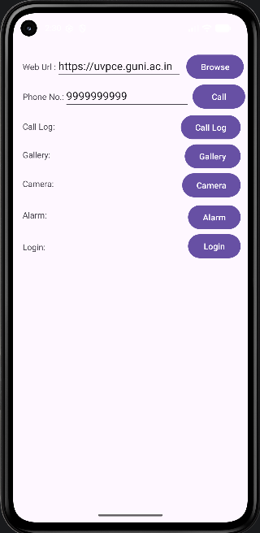
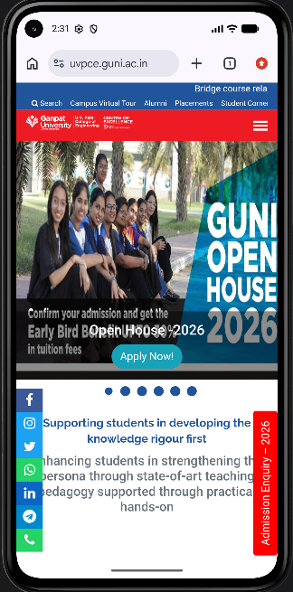
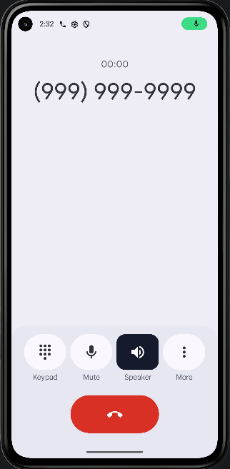
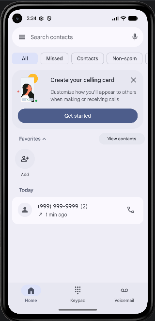
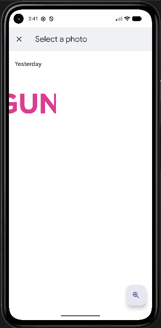
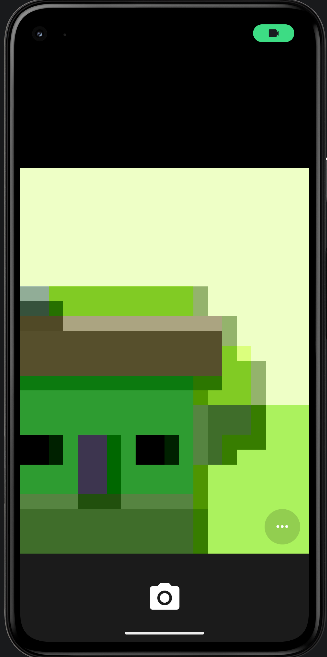
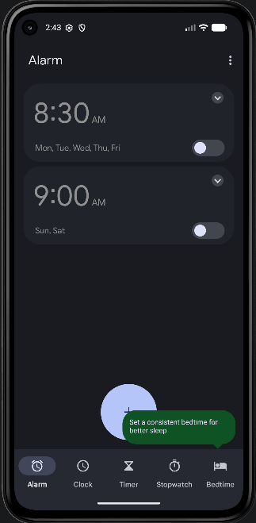
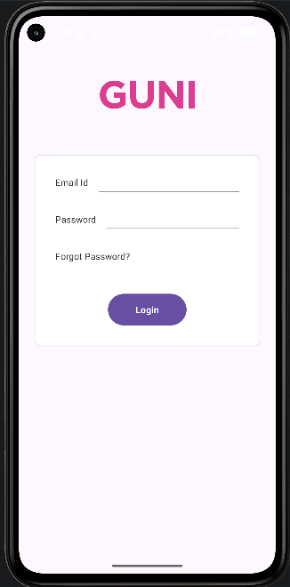

# 📱 Practical 3 — Implicit & Explicit Intents

An Android application demonstrating Implicit and Explicit Intents by launching system apps and a custom Login screen from a single UI.

### 🎯 Aim

Create an Android application which demonstrates implicit & explicit Intent.

### ✨ Features

| # | Action | Intent Type | Description |
| :--- | :--- | :--- | :--- |
| 1 | 🌐 Browse | Implicit | Opens a URL entered by the user in a browser |
| 2 | 📞 Call | Implicit | Dials a phone number entered by the user |
| 3 | 📋 Call Log | Implicit | Opens the device's Call Log |
| 4 | 🖼️ Gallery | Implicit | Opens the Gallery to view images |
| 5 | 📷 Camera | Implicit | Opens the Camera app |
| 6 | ⏰ Alarm | Implicit | Opens the Clock app's Alarms screen |
| 7 | 🔐 Login | Explicit | Navigates to a custom LoginActivity |

### 🛠️ Tech Stack

*   **Language:** Kotlin
*   **Layout:** ConstraintLayout
*   **Min SDK / Target SDK:** As configured in `build.gradle`
*   **IDE:** Android Studio

### 📚 Study Concepts Covered

*   Intent & types of Intent (Implicit vs Explicit)
*   Types of Intent Action (`ACTION_VIEW`, `ACTION_DIAL`, `ACTION_IMAGE_CAPTURE`, `ACTION_SHOW_ALARMS`, `ACTION_MAIN`)
*   `Intent.setData()` and `Intent.setType()` methods
*   `Uri.parse()` method
*   `startActivity()` method
*   `ContactsContract.Contacts.CONTENT_TYPE`
*   `CallLog.Calls.CONTENT_URI`
*   MIME types — `"image/*"`
*   URI schemes — `"tel:"`
*   Button, EditText, ConstraintLayout
*   Adding a new Activity to an Android project
*   Adding Drawable resources to an Android project
*   Registering Activities in `AndroidManifest.xml`

### 📂 Project Structure

```text
app/
└── src/main/
    ├── java/com/dev/a24012011080_mad_pr3/
    │   ├── MainActivity.kt        → Implicit + Explicit Intent triggers
    │   └── LoginActivity.kt       → Explicit Intent target screen
    ├── res/layout/
    │   ├── activity_main.xml
    │   └── activity_login.xml
    └── AndroidManifest.xml        → Activities registered here
🧩 Key Code Snippets
Implicit Intent — Open URL
Intent(Intent.ACTION_VIEW, Uri.parse(url)).also { startActivity(it) }
Implicit Intent — Dial a Number
val i = Intent(Intent.ACTION_DIAL)
i.setData("tel:$number".toUri())
startActivity(i)
Implicit Intent — Open Gallery
Intent(Intent.ACTION_VIEW).setType("image/*").apply { startActivity(this) }
Explicit Intent — Open Login Activity
Intent(this@MainActivity, LoginActivity::class.java).also { startActivity(it) }▶️ How to Run
Open the project in Android Studio.

Let Gradle sync complete.

Run on an emulator or physical device (Pixel 8 / API 30+ recommended).

Tap each button and verify the corresponding app/screen opens:

Browse → Opens the entered URL in a browser

Call → Opens the Dialer with the entered number

Call Log → Opens the device's Call Log

Gallery → Opens the Gallery app

Camera → Opens the Camera app

Alarm → Opens the Clock app's Alarm screen

Login → Navigates to the custom Login screen
### 📸 Screenshots

| Main Menu | Browser | Dialer | Call Log |
| :---: | :---: | :---: | :---: |
|  |  |  |  |
| **Gallery** | **Camera** | **Alarms** | **Login** |
|  |  |  |  |
👤 Submitted By
Name: Krish Patel

Enrollment No: 24012011097

Practical: 03
